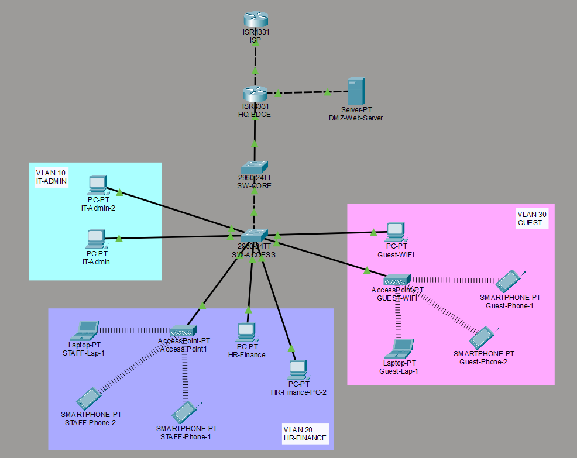
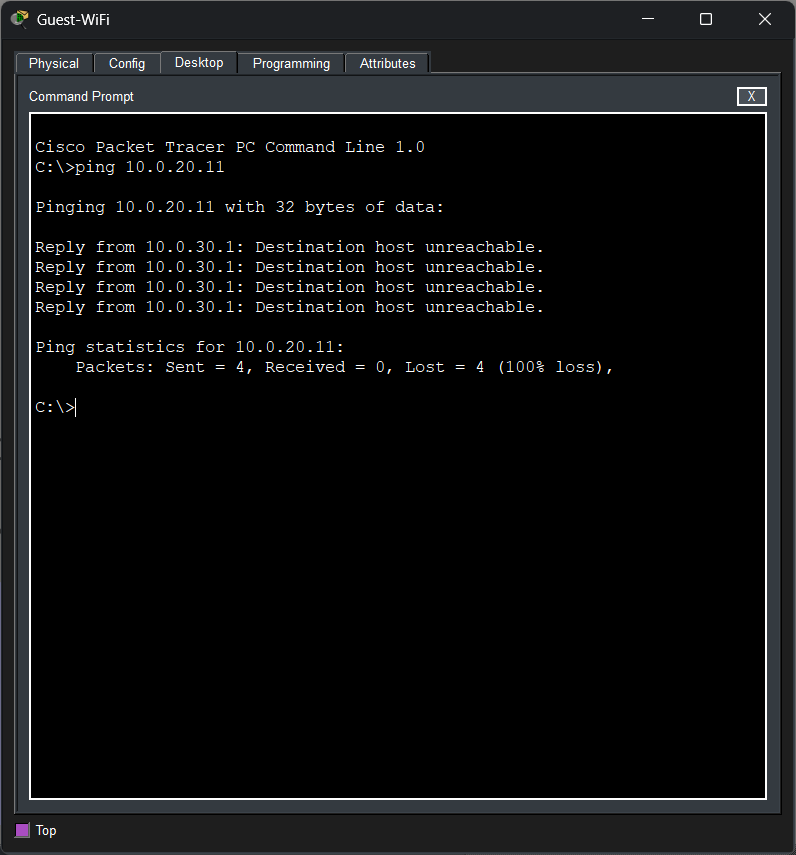
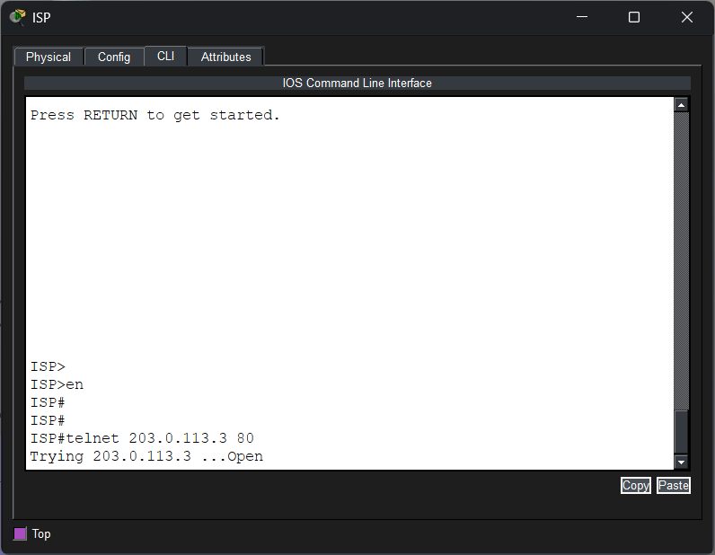
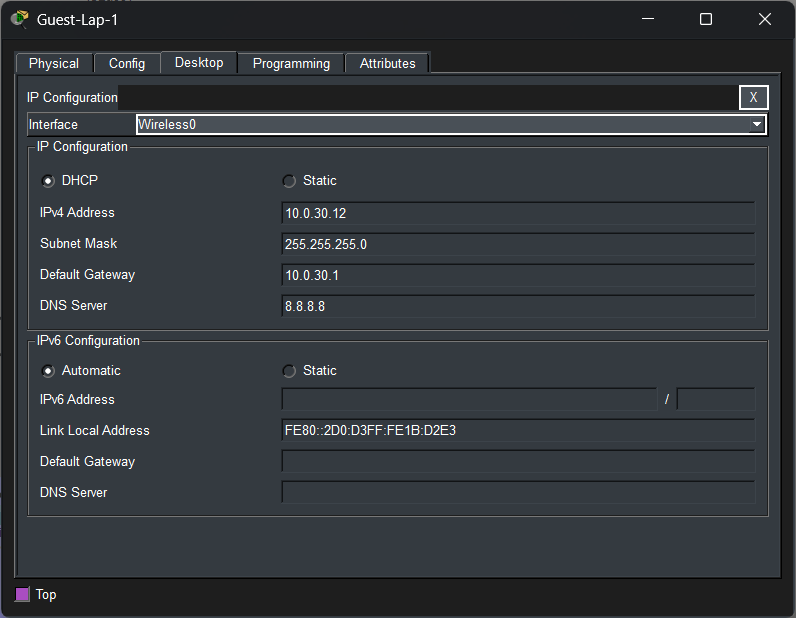

# 🛡️ Secure Enterprise Headquarters Architecture

## 📋 Project Overview
Designed and implemented a highly secure, segmented corporate headquarters network architecture. This project demonstrates advanced enterprise routing, Zero-Trust internal segmentation, edge security, and defense against common network attacks (IP spoofing, unauthorized remote access). 

The infrastructure features both wired and wireless deployment and is designed to be fully managed by custom **Python (Netmiko)** automation scripts for configuration backups and disaster recovery.

---

## 🏗️ Network Architecture

### **1. Edge Security & DMZ**
* **NAT / PAT Implementation:** Configured Port Address Translation (Overload) for internal staff internet access, and Static NAT to expose a public-facing Web Server hosted within the isolated DMZ.
* **Anti-Spoofing Defenses:** Deployed strict inbound Extended ACLs on the WAN interface to instantly drop any external traffic attempting to spoof internal RFC1918 IP addresses.

### **2. Internal Zero-Trust Segmentation**
* **Router-on-a-Stick (802.1Q):** Centralized Inter-VLAN routing with dedicated sub-interfaces acting as secure default gateways.
* **Micro-Segmentation:** Implemented strict access control to isolate the Guest Wi-Fi (VLAN 30) from the IT (VLAN 10) and HR/Finance (VLAN 20) departments.

### **3. Wireless Integration & DHCP Security**
* **WLAN Deployment:** Integrated Wireless Access Points (WAPs) into the Access Layer, utilizing `spanning-tree portfast` to bypass listening/learning states for rapid wireless client association.
* **Advanced ACL Hole-Punching:** Engineered a custom Extended ACL rule set to explicitly permit `0.0.0.0` (UDP 67/68) DHCP Discover broadcasts through the Zero-Trust firewall, allowing wireless clients to obtain IP addresses without exposing the internal network.

---

## 📸 Architecture Proofs

* **Global Topology:** Layer 2/3 Enterprise Architecture  
  

* **Zero-Trust Security Proof:** Internal Guest Isolation routing rejection  
  

* **Edge Security Proof:** Successful external routing to DMZ Web Server  
  

* **Wireless DHCP Proof:** Successful dynamic IP allocation through the Zero-Trust Firewall  
  

---

## 🔒 Device Hardening & Cryptography
To defeat packet sniffing and unauthorized access, the management plane of all routers and Layer 2 switches was severely hardened:
* Completely disabled unencrypted `Telnet` access.
* Generated **2048-bit RSA Cryptographic Keys**.
* Enforced **SSHv2** on all VTY lines with local user databases and encrypted secret passwords.
* Mitigated VLAN hopping attacks by moving the native VLAN to an unused blackhole (VLAN 99).

---

## 🛠️ Technologies & Protocols
* **Infrastructure:** Cisco IOS, Packet Tracer 8.x
* **Routing & Switching:** Inter-VLAN Routing (802.1Q Trunking), Layer 2/3 Architecture, Spanning-Tree (PortFast)
* **Security:** Extended/Standard ACLs, SSHv2, RSA Cryptography, Zero-Trust modeling
* **Services:** NAT (Static), PAT (Overload), DHCP, Wireless LAN (WLC/WAP)

---
*Designed and implemented by Duneth Widanapathirana | [Portfolio](https://duneth.me)*
